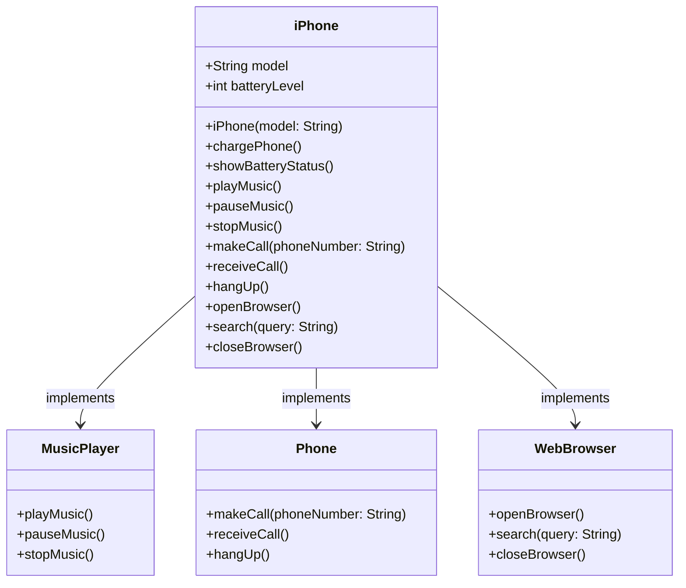

<h1> Desafio-Iphone-UML </h1>

<h2>📖 Sobre</h2>
<p>Este projeto é uma simulação de funcionalidades básicas de um <strong>telefone</strong>, <strong>reprodutor de música</strong> e <strong>navegador web</strong> desenvolvida em <strong>Java</strong>. Ele permite realizar chamadas, tocar música e buscar informações na web de maneira simples e eficiente.</p>

<p>O projeto foi desenvolvido com o intuito de demonstrar como diferentes funcionalidades podem ser integradas em uma única aplicação utilizando interfaces e classes anônimas no Java.</p>

## 🚀 Tecnologias

<div>
  
  
</div>

<p>Este projeto utiliza as seguintes tecnologias:</p>
<ul>
  <li><strong>Java</strong>: Linguagem de programação utilizada para o desenvolvimento do projeto.</li>
  <li><strong>IntelliJ IDEA</strong>: IDE utilizada para o desenvolvimento do projeto.</li>
</ul>

## 📊 Estado do Projeto


> O projeto está 100% funcional, com todas as funcionalidades implementadas.

## Autor
<h2>Marco Antônio</h2>

<p>Desenvolvedor Full-Stack Java</p>

<p>
  <a href="https://github.com/marcosynky" target="_blank">
    
  </a>
<a href="https://www.linkedin.com/in/marco-antônio-developer-fullstack" target="_blank">
    
</a>

</p>

## 📱 Funcionalidades

- Realização de chamadas telefônicas.
- Aceitação e encerramento de chamadas.
- Reprodução, pausa e interrupção de músicas.
- Abertura de navegador, busca na web e fechamento do navegador.




## 🛠️ Como Rodar o Projeto

### Pré-requisitos

1. **Java JDK**: Verifique se o JDK está instalado corretamente no seu sistema.
   - Instalação do JDK: [JDK Docs](https://docs.oracle.com/en/java/javase/)

2. **IDE**: É recomendado usar uma IDE como o IntelliJ IDEA ou Eclipse para facilitar a execução e depuração do projeto.
   - IntelliJ IDEA: [Download IntelliJ IDEA](https://www.jetbrains.com/idea/download/)

### Passos para rodar o projeto

1. Clone o repositório para sua máquina local:

```bash
git clone https://github.com/marcosynky/phone-music-webbrowser.git
